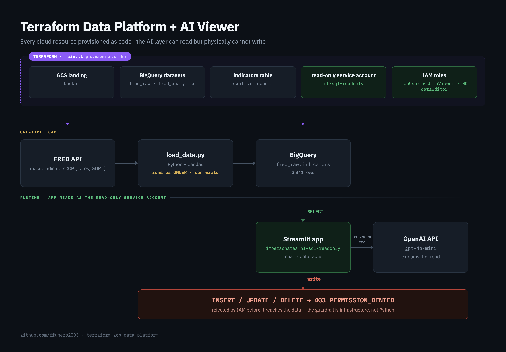
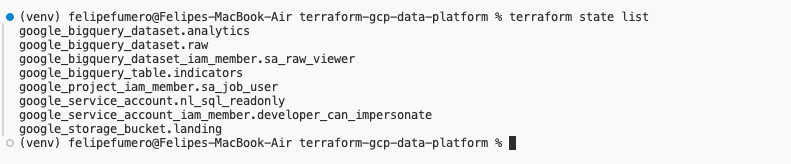
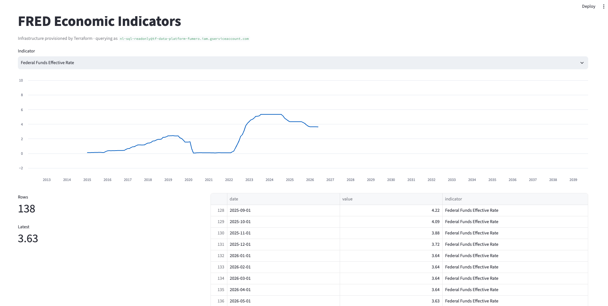
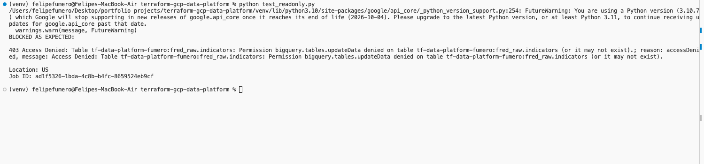

# Terraform Data Platform + AI Viewer

A minimal analytics platform on Google Cloud where **every resource is provisioned as code** with Terraform, and a Streamlit + AI viewer on top **can read the data but physically cannot write it** — because the infrastructure won't allow it.

> The AI layer can generate any query it wants, but the service account Terraform gave it can only read. The guardrail is enforced at the infrastructure layer (IAM), not by a string check in application code.



---

## What this is

Terraform provisions the entire stack from a single `terraform apply`:

- a **GCS landing bucket**
- two **BigQuery datasets** — `fred_raw` and `fred_analytics` (raw / dbt-target separation)
- an **`indicators` table** with an explicit, code-defined schema
- a **read-only service account** (`nl-sql-readonly`)
- its **IAM roles** — `bigquery.jobUser` + `bigquery.dataViewer`, and nothing else

A one-time Python loader pulls live FRED economic indicators into BigQuery **as the project owner** (which can write). A Streamlit app on top authenticates **as the read-only service account via impersonation** — no key file ever touches disk — charts any indicator, and has an "Explain with AI" button that sends the on-screen rows to an LLM for a plain-English trend read.

Because the app runs as the read-only SA, any `INSERT` / `UPDATE` / `DELETE` it (or the AI) generates is rejected by IAM with `403 PERMISSION_DENIED` before it ever reaches the data.

---

## Why it's built this way

| Decision                           | Reason                                                                                                                  |
| ---------------------------------- | ----------------------------------------------------------------------------------------------------------------------- |
| 100% Infrastructure-as-Code        | Reproducible, versioned, reviewable. Rebuild the whole platform from one command; every change is a git diff.           |
| Least-privilege service account    | `jobUser` (start a query job) + `dataViewer` (read one dataset) only. No `dataEditor`, no `dataOwner`.                  |
| Impersonation instead of key files | The app borrows the SA's identity at runtime with a short-lived token — no long-lived secret on disk to leak or commit. |
| Separate write vs. read identities | The loader writes as the owner; the app reads as the SA. The two paths are deliberately distinct.                       |
| Guardrail in IAM, not app code     | A write is blocked by the platform, not by a `if query.startswith("SELECT")` check that a bug could bypass.             |

---

## Screenshots

|                                                                       |                                         |
| --------------------------------------------------------------------- | --------------------------------------- |
| **Everything as code** — `terraform state list` shows all 8 resources |   |
| **The app** — Streamlit viewer, querying as the read-only SA          |       |
| **The guardrail** — a write attempt is rejected by IAM                |  |

---

## Stack

Terraform (GCP provider) · Google Cloud (BigQuery, GCS, IAM) · Python · pandas · Streamlit · FRED API · OpenAI API

---

## Running it locally

### Prerequisites

- Terraform >= 1.5
- `gcloud` CLI, authenticated (`gcloud auth application-default login`)
- A GCP project with billing enabled
- A [FRED API key](https://fred.stlouisfed.org/docs/api/api_key.html) and an OpenAI API key

### 1. Configure

Create `terraform.tfvars`:

```hcl
project_id      = "your-gcp-project-id"
developer_email = "your-gcloud-account@example.com"
```

Create `.env` (gitignored):

```
FRED_API_KEY=your_fred_key
OPENAI_API_KEY=your_openai_key
```

### 2. Provision the infrastructure

```bash
terraform init
terraform plan      # dry run — review what will be created
terraform apply     # creates all resources
```

### 3. Load data and run the app

```bash
python -m venv venv && source venv/bin/activate
pip install -r requirements.txt

python load_data.py     # loads FRED indicators (runs as owner)
streamlit run app.py    # opens the viewer at localhost:8501
```

### 4. Prove the guardrail

```bash
python test_readonly.py   # attempts a DELETE as the SA -> 403 PERMISSION_DENIED
```

### 5. Tear it all down

```bash
terraform destroy     # removes every resource this repo created
```

---

## Repo layout

```
.
├── main.tf              # provider + all resources (bucket, datasets, table, SA, IAM)
├── variables.tf         # inputs (project_id, region, bq_location, developer_email)
├── outputs.tf           # bucket name, dataset, table path, SA email
├── load_data.py         # one-time FRED -> BigQuery loader (runs as owner)
├── app.py               # Streamlit viewer (runs as read-only SA via impersonation)
├── test_readonly.py     # proves the SA cannot write
├── architecture.png     # diagram above
└── .gitignore           # ignores state, .env, tfvars, venv
```

## Notes / scope

Deliberately minimal — one bucket, two datasets, one table, one service account, a one-page viewer, and one AI button. The point is the **infrastructure-enforced read-only boundary**, not feature breadth. State is local (no remote backend), metadata is not persisted beyond BigQuery, and resources are torn down with `terraform destroy` after use.
